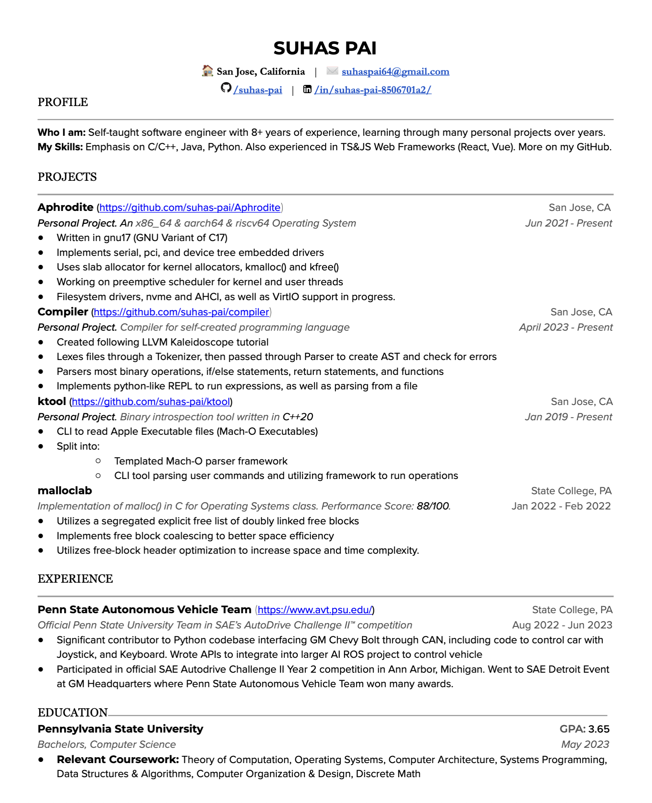
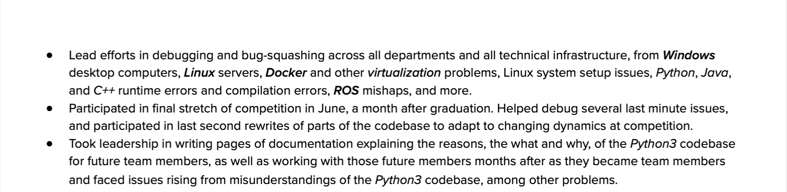

# Hi there 👋

- 🔭 I’m currently working on [Aphrodite](https://github.com/suhas-pai/Aphrodite), [compiler](https://github.com/suhas-pai/compiler), and [react-twitter](https://github.com/suhas-pai/react-twitter)
- 🌱 I’m currently learning more about operating systems, compilers, programming languages, LLVM, and full stack web development

Learn more on my Resume:

<!--
**suhas-pai/suhas-pai** is a ✨ _special_ ✨ repository because its `README.md` (this file) appears on your GitHub profile.

Here are some ideas to get you started:

- 🔭 I’m currently working on ...
- 🌱 I’m currently learning ...
- 👯 I’m looking to collaborate on ...
- 🤔 I’m looking for help with ...
- 💬 Ask me about ...
- 📫 How to reach me: ...
- 😄 Pronouns: ...
- ⚡ Fun fact: ...
-->
